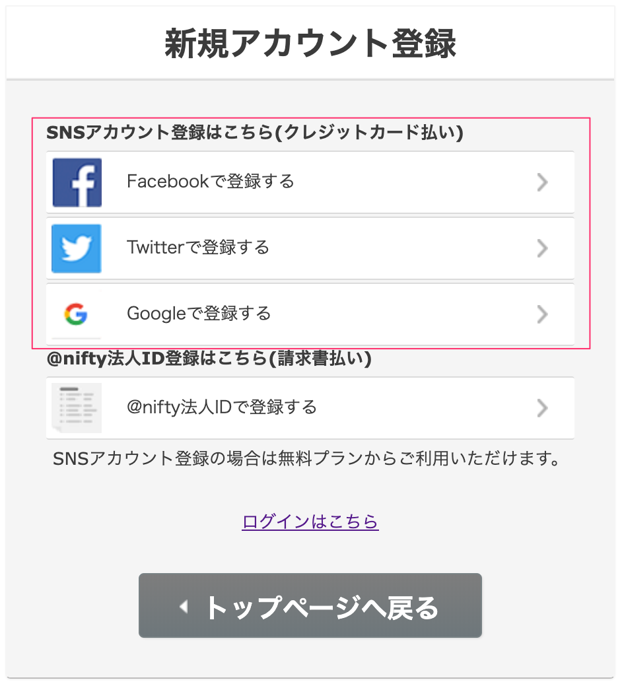
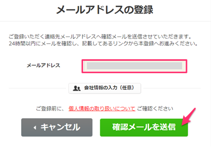
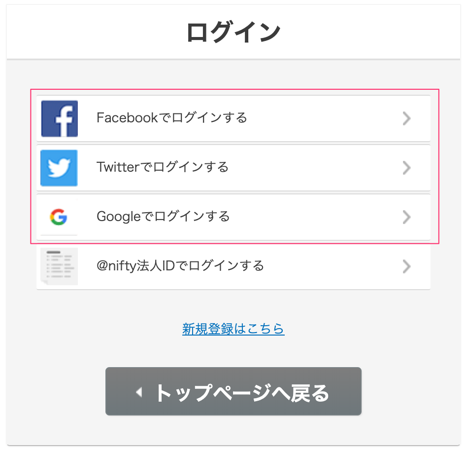
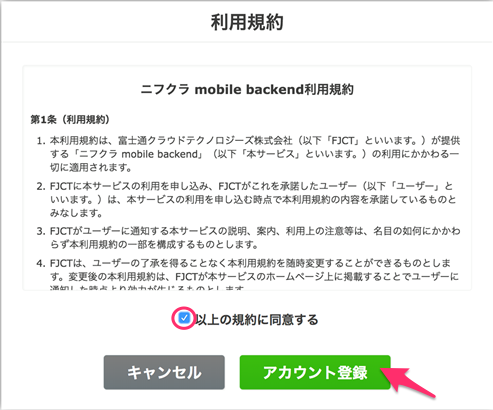
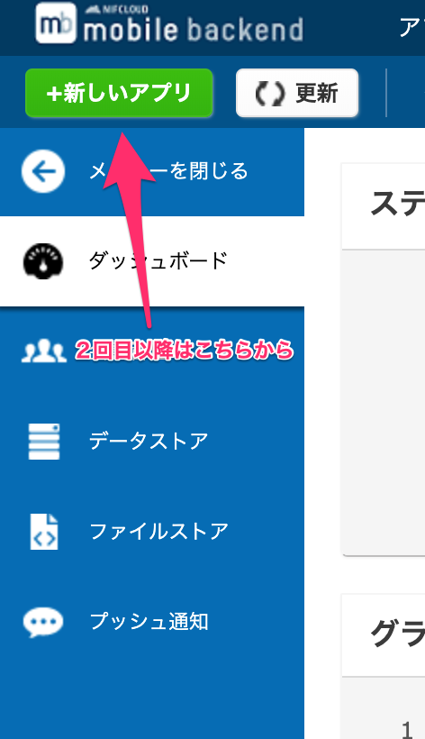

title: mobile backend を使ってみよう
class: animation-fade
layout: true

<!-- This slide will serve as the base layout for all your slides -->
.bottom-bar[
  {{title}}
]

---

class: impact

# {{title}}
## with Monaca

.right[]

.footnote[
.left[
.size_small_7[
Copyright 2020 FUJITSU CLOUD TECHNOLOGIES LIMITED<br>
Created by Natsumo Ikeda
2020/01/27 Update
]
]
]


---
title: はじめに
layout: true
class: center, middle, animation-fade

---
# {{title}}

---
title: はじめに
layout: false

# 概要

とりあえず mobile backend を使ってみましょう。<br>そして、何ができるか実際に触って理解しましょう。

* 今日の演習だけでも mobile backend のデータベース機能「データストア」の基本はマスターできます👍

.bottom-bar[
{{title}}
]

---
title: はじめに

## アジェンダ

.size_small_9[
1. mobile backend って何？
1. mobile backend を手っ取り早く使うには
1. 実際に触ってみましょう①
  1. Monaca の準備
  1. Monaca の練習
  1. mobile backend の準備
  1. mobile backend と Monaca を連携する
  1. mobile backend にデータを保存する
1. 実際に触ってみましょう②
  1. mobile backend に保存したデータを取得する
1. まとめ
]
.bottom-bar[
{{title}}
]

---
title: 1.&nbsp;mobile backend って何？
layout: true
class: center, middle, animation-fade

---
# {{title}}

---
title: 1.&nbsp;mobile backend って何？
layout: false

## 私たちが提供するサービス ニフクラ mobile backend とは何か？

.col-7[
.size_small_9[
一言で言うなれば<br>
「 **構築不要ですぐに使えるクラウドデータベース** 」<br>
アプリ開発に必要な機能は大体用意されているので、<br>
使い方さえマスターしてしまえばこっちのものです。<br>
<br>
これから学習することは、
* **何ができるか知る**
* **使い方を覚える**

の２点です。
]
]
.col-5[
.center[

]
]
.bottom-bar[
{{title}}
]

---
title: 2.&nbsp;mobile backend を手っ取り早く使うには
layout: true
class: center, middle, animation-fade

---
# {{title}}

---
title: 2.&nbsp;mobile backend を手っ取り早く使うには
layout: false

## mobile backend を手っ取り早く使うには

.size_small_9[
開発中のアプリがあればそれに組み込むのが一番良いですが、.size_small_7[（AndroidでもiOSでもUnityでも）]<br>
０からアプリを作る場合には .color_pink[**Monaca**] がオススメです👌
]
.col-7[
.size_small_9[
* mobile backend との連携が楽
* 環境構築不要：ブラウザで開発
* 使いやすい言語：JavaScript

などなど、親和性が高く使い勝手が良いです。

本講では .color_pink[**Monaca**] を使って mobile backend の使い方を習得していきましょう。
]
]
.col-5[
.center[

]
]

.bottom-bar[
{{title}}
]

---
title: 3.&nbsp;実際に触ってみましょう①
layout: true
class: center, middle, animation-fade

---
# {{title}}

---
title: 3.&nbsp;実際に触ってみましょう①
layout: false

## 実際に触ってみましょう①

1. Monaca の準備
1. Monaca の練習
1. mobile backend の準備
1. mobile backend と Monaca を連携する
1. mobile backend にデータを保存する

.bottom-bar[
{{title}}
]

---
title: 3.&nbsp;実際に触ってみましょう①

### 1. Monaca の準備

環境準備ができているか確認をしましょう。

* ブラウザ環境の準備
  * __<a href='https://www.google.com/chrome/' target='_blank'>Google Chrome&nbsp;↗️</a>__
* Monaca Education アカウントの取得
  * __<a href='https://monaca.education/ja/signup' target='_blank'>Monaca&nbsp;Education&nbsp;アカウント作成&nbsp;↗️</a>__

.bottom-bar[
{{title}}
]

.bottom-bar[
{{title}}
]

---
title: 3.&nbsp;実際に触ってみましょう①

### 1. Monaca の準備

.size_small_9[
Monaca にログインします。
]
.center[]

.size_small_7[
__<a href="https://edu.monaca.io/" target="_blank">Monaca Education トップページ ↗️</a>__<br>
`https://edu.monaca.io/`
]

.bottom-bar[
{{title}}
]

---
title: 3.&nbsp;実際に触ってみましょう①

### 1. Monaca の準備

.col-6[
.size_small_9[
プロジェクトを作ります。
]
.center[]
]
.col-6[
.size_small_9[
最小限のテンプレートを選択します。
]
.center[]
]
.bottom-bar[
{{title}}
]

---
title: 3.&nbsp;実際に触ってみましょう①

### 1. Monaca の準備

.size_small_9[
プロジェクト名はこのままでOKです。「作成」をクリックします。
]
.center[]

.bottom-bar[
{{title}}
]

---
title: 3.&nbsp;実際に触ってみましょう①

### 1. Monaca の準備

.size_small_9[
プロジェクトが作成されます。<br>
プロジェクトを選択して、「クラウドIDEで開く」をクリックします。

]
.center[]

.bottom-bar[
{{title}}
]

---
title: 3.&nbsp;実際に触ってみましょう①

### 1. Monaca の準備

.size_small_9[
プロジェクトが開かれます。
]
.center[]


.bottom-bar[
{{title}}
]

---
title: 3.&nbsp;実際に触ってみましょう①

### 2. Monaca の練習

.size_small_9[
アプリの画面を構成する、 `index.html` の `body` タグ内を少し編集してみましょう。
]
.center[]

.bottom-bar[
{{title}}
]

---
title: 3.&nbsp;実際に触ってみましょう①

### 2. Monaca の練習

.size_small_9[
一度消して、何か書いてみましょう。
]
.center[]

.bottom-bar[
{{title}}
]

---
title: 3.&nbsp;実際に触ってみましょう①

### 2. Monaca の練習
.col-9[
.size_small_9[
書けたら保存します。<br>
ツールバー左のボタンをクリックすると保存されます。
]
.center[]
]
.col-3[
.size_small_7[
✅コマンドでも保存できます
* Windows「Ctrl + s」
* Mac「command + s」
]
]
.bottom-bar[
{{title}}
]

---
title: 3.&nbsp;実際に触ってみましょう①

### 2. Monaca の練習

.size_small_9[
保存すると、右側プレビュー画面が更新され `body` タグ内に書いた文字が表示されます。
]
.center[]

.bottom-bar[
{{title}}
]

---
title: 3.&nbsp;実際に触ってみましょう①

### 2. Monaca の練習

.size_small_9[
それでは本題に入りましょう。<br>
**押すと mobile backend にデータが保存されるボタン** を作ってみましょう！<br>
さっき書き換えた文字の下に `button` タグを用意します。

.size_small_5[コーディングする内容：]
```html
<button>押してみて</button>
```

]
.size_small_5[出来上がりイメージ：]<br>

.bottom-bar[
{{title}}
]

---
title: 3.&nbsp;実際に触ってみましょう①

### 2. Monaca の練習

.size_small_9[
書けたら保存をしてプレビュー画面で確認しましょう。
]
.center[]
.size_small_7[
✅ボタンが表示されますが、クリックしてもまだ何の反応もありません。
]
.bottom-bar[
{{title}}
]

---
title: 3.&nbsp;実際に触ってみましょう①

### 2. Monaca の練習

.size_small_9[
ボタンに **クリックイベント** （クリックしたときの動作）を追加しましょう。

.size_small_5[コーディングする内容：]<br>
```html
<button onclick="">押してみて</button>
```
]
.size_small_5[出来上がりイメージ：]<br>


.bottom-bar[
{{title}}
]

---
title: 3.&nbsp;実際に触ってみましょう①

### 2. Monaca の練習

.size_small_9[
`""` の間に次のように書いてください。

.size_small_5[コーディングする内容：]<br>
```html
<button onclick="addData()">押してみて</button>
```
]
.size_small_5[出来上がりイメージ：]<br>


.size_small_7[
`addData()` はこれから「 **mobile backend にデータを保存する処理** 」を書く **function** （関数）の名前です。
 ]
.bottom-bar[
{{title}}
]

---
title: 3.&nbsp;実際に触ってみましょう①

### 2. Monaca の練習
.size_small_9[
「 **mobile backend にデータを保存する処理** 」を書く function「 `addData()` 」を用意しましょう。
.size_small_7[
ここまでは html という言語で記述しましたが、
ここからは mobile backend を扱います。 JavaScript という言語を扱う場合は、`script` タグ内に記述します。
]
10行目の `script` タグの中に記述します。

.size_small_5[コーディングする内容：]<br>
```html
<script>
    function addData() {
      // ここに処理を書きます
    }
</script>
```
]

.bottom-bar[
{{title}}
]

---
title: 3.&nbsp;実際に触ってみましょう①

### 2. Monaca の練習

.size_small_5[出来上がりイメージ：]<br>


.bottom-bar[
{{title}}
]

---
title: 3.&nbsp;実際に触ってみましょう①

### 2. Monaca の練習

.size_small_9[
ここで一旦、動作確認をしておきましょう。<br>
button と function が本当に連携しているのか？ を確認します。

button を押したとき **alert** を表示するように書いてみます。

.size_small_5[コーディングする内容：]<br>
```html
<script>
    function addData() {
      alert("ボタンが押されたよ");
    }
</script>
```
]

.bottom-bar[
{{title}}
]

---
title: 3.&nbsp;実際に触ってみましょう①

### 2. Monaca の練習

.size_small_5[出来上がりイメージ：]<br>


.bottom-bar[
{{title}}
]

---
title: 3.&nbsp;実際に触ってみましょう①

### 2. Monaca の練習

.size_small_9[
保存してからプレビュー画面でボタンを押してみましょう。<br>
ブラウザの `alert` が表示されればOKです。
]
.center[]
.size_small_5[
✅次の作業のために alert のコードは先頭に `//` をつけて **コメント化** （実行されない状態）しておきましょう。
```js
// alert("ボタンが押されたよ");
```
]
.bottom-bar[
{{title}}
]

---
title: 3.&nbsp;実際に触ってみましょう①

### 3. mobile backend の準備

環境準備ができているか確認をしましょう。

* ニフクラ mobile backend アカウントの取得
  * __<a href='https://mbaas.nifcloud.com/signup.htm' target='_blank'>ニフクラ&nbsp;mobile&nbsp;backend&nbsp;アカウント作成&nbsp;↗️</a>__

.bottom-bar[
{{title}}
]

---
title: 3.&nbsp;実際に触ってみましょう①

### 3. mobile backend の準備

★ここから
.size_small_9[
**mobile backend にデータが保存されるボタン** を作るために、ここからは mobile backend 側の準備をしていきましょう。まずはアカウントを用意します。「無料登録」をクリックします。
]
.center[]

__<a href='https://mbaas.nifcloud.com/' target='_blank'>mbaas.nifcloud.com&nbsp;↗️</a>__

https://console.mbaas.nifcloud.com/login
.bottom-bar[
{{title}}
]

---
title: 3.&nbsp;実際に触ってみましょう①

### 3. mobile backend の準備


**無料** で利用するには SNSアカウント で会員登録を行います。

.center[]

利用可能なSNSアカウント
* Facebook
* Twitter
* Google (Gmail)

.right_under[
.size_small_7[
.font_color_ncmb_blue[
3.実際に触ってみましょう①
]
]
]

---
#### 3. mobile backend の準備


.center[]

.size_small_7[
＜いずれのアカウントも所持していない場合＞<br>いずれも無料で作成可能ですが、Googleアカウント（Gmail）がおすすめです。<br><a href='https://accounts.google.com/signup' target='_blank'>Googleアカウントの作成</a>
]

.right_under[
.size_small_7[
.font_color_ncmb_blue[
3.実際に触ってみましょう①
]
]
]

---
#### 3. mobile backend の準備

認証処理が完了すると、メールアドレスの登録画面が表示されます。メールアドレスを入力して「確認メールを送信」をクリックします。

.center[]

確認メールが届くので指示に従って会員登録を進めてください。

.size_small_7[
※このメールアドレスはSNSアカウントとは別に、自由に設定できます。
]

.right_under[
.size_small_7[
.font_color_ncmb_blue[
3.実際に触ってみましょう①
]
]
]

---
#### 3. mobile backend の準備

会員登録が完了したらログインをします。

.center[]

<a href='https://mbaas.nifcloud.com/' target='_blank'>mbaas.nifcloud.com</a>

.right_under[
.size_small_7[
.font_color_ncmb_blue[
3.実際に触ってみましょう①
]
]
]

---
#### 3. mobile backend の準備

会員登録をする際に使用した SNSアカウント を選択します。

.center[]

.right_under[
.size_small_7[
.font_color_ncmb_blue[
3.実際に触ってみましょう①
]
]
]

---
#### 3. mobile backend の準備

初回のみ利用規約に同意が必要です。内容を確認したらチェックを入れ、 「アカウント登録」をクリックします。

.center[]

.right_under[
.size_small_7[
.font_color_ncmb_blue[
3.実際に触ってみましょう①
]
]
]

---
#### 3. mobile backend の準備

ログインが完了すると、「アプリの新規作成」画面が表示されます。作成するアプリ単位で、mobile backend 上にもアプリを作成します。<br>「TestApp」と入力して、「新規作成」をクリックしましょう。

.center[]

.left-column[
.size_small_7[
.right[
＜利用がはじめてではない場合＞<br>既にアプリを作成している場合は、<br>改めてアプリを作成します。
]
]
]

.right-column[

]

.right_under[
.size_small_7[
.font_color_ncmb_blue[
3.実際に触ってみましょう①
]
]
]

---
#### 3. mobile backend の準備

アプリが作成されると、 **APIキー** が発行されます。後ほど使用します。一旦「OK」をクリックして画面を閉じます。

.center[]

.size_small_7[
（参考）APIキーは２種類
* アプリケーションキー
  * アプリを特定するためのキー（ユニークキー）
* クライアントキー
  * 認証キー
]

.right_under[
.size_small_7[
.font_color_ncmb_blue[
3.実際に触ってみましょう①
]
]
]

---
#### 3. mobile backend の準備

管理画面のダッシュボードが表示されます。

.center[]

.right_under[
.size_small_7[
.font_color_ncmb_blue[
3.実際に触ってみましょう①
]
]
]

---
#### 3. mobile backend の準備

文字列データは「データストア」に保存されます。（この後使っていきます。）

.center[]

.size_small_7[
（参考）デフォルトクラス：
* installation
  * プッシュ通知配信端末情報が格納されるクラス
* role
  * 会員管理で設定した会員グループが格納されるクラス
]

.right_under[
.size_small_7[
.font_color_ncmb_blue[
3.実際に触ってみましょう①
]
]
]

---
#### 4. mobile backend と Monaca を連携する

いよいよ **mobile backend にデータを保存する処理** を実装していきます。<br>
Monaca に戻って、図の手順で実装していきます。

.center[]

.right_under[
.size_small_7[
.font_color_ncmb_blue[
3.実際に触ってみましょう①
]
]
]

---
#### 4. mobile backend と Monaca を連携する
##### 4.1. mobile backend のSDKを導入する（コンポーネントの追加）

「設定」＞「JS/CSSコンポーネントの追加と削除」をクリックします。

.center[]


.right_under[
.size_small_7[
.font_color_ncmb_blue[
3.実際に触ってみましょう①
]
]
]

---
#### 4. mobile backend と Monaca を連携する
##### 4.1. mobile backend のSDKを導入する（コンポーネントの追加）

「コンポーネント名」に「 **ncmb** 」と入力して「検索する」をクリックします。

.center[]


.right_under[
.size_small_7[
.font_color_ncmb_blue[
3.実際に触ってみましょう①
]
]
]

---
#### 4. mobile backend と Monaca を連携する
##### 4.1. mobile backend のSDKを導入する（コンポーネントの追加）

mobile backend のSDK「ncmb」が表示されるので「追加」をクリックします。

.center[]


.right_under[
.size_small_7[
.font_color_ncmb_blue[
3.実際に触ってみましょう①
]
]
]

---
#### 4. mobile backend と Monaca を連携する
##### 4.1. mobile backend のSDKを導入する（コンポーネントの追加）

バージョンはそのままで、「インストール」をクリックします。

.center[]


.right_under[
.size_small_7[
.font_color_ncmb_blue[
3.実際に触ってみましょう①
]
]
]

---
#### 4. mobile backend と Monaca を連携する
##### 4.1. mobile backend のSDKを導入する（コンポーネントの追加）

必ずチェックボックスにチェックを入れてください。「保存」をクリックします。

.center[]


.right_under[
.size_small_7[
.font_color_ncmb_blue[
3.実際に触ってみましょう①
]
]
]

---
#### 4. mobile backend と Monaca を連携する
##### 4.1. mobile backend のSDKを導入する（コンポーネントの追加）

一覧に「ncmb」が表示されればSDK導入完了です。

.center[]


.right_under[
.size_small_7[
.font_color_ncmb_blue[
3.実際に触ってみましょう①
]
]
]

---
#### 4. mobile backend と Monaca を連携する
##### 4.2. 導入したSDKを初期化する

SDKは使う前に必ず初期化をする必要があります。初期化には mobile backend でアプリ作成時に発行された  **APIキー** を使います。まずは変数としてAPIキーの置き場を用意しましょう。

.center[]


.right_under[
.size_small_7[
.font_color_ncmb_blue[
3.実際に触ってみましょう①
]
]
]

---
#### 4. mobile backend と Monaca を連携する
##### 4.2. 導入したSDKを初期化する

mobile backend の管理画面を開いて、APIキーを確認します。APIキーは「アプリ設定」にあります。コピーボタンを使ってそれぞれ変数に代入しましょう。

.center[]


.right_under[
.size_small_7[
.font_color_ncmb_blue[
3.実際に触ってみましょう①
]
]
]


---
#### 4. mobile backend と Monaca を連携する
##### 4.2. 導入したSDKを初期化する

貼り付け終わるとこんな感じです。

.center[]


.right_under[
.size_small_7[
.font_color_ncmb_blue[
3.実際に触ってみましょう①
]
]
]


---
#### 4. mobile backend と Monaca を連携する
##### 4.2. 導入したSDKを初期化する

APIキーを引数に設定して以下のように書くとSDKが初期化されます。

.center[]

.size_small_7[
（参考）4.1. と 4.2. は mobile backend を使う際、必ず必要な作業です。覚えておきましょう。
]

.right_under[
.size_small_7[
.font_color_ncmb_blue[
3.実際に触ってみましょう①
]
]
]


---
#### 5. mobile backend にデータを保存する
##### 5.1. mobile backend に「Hello, NCMB!」と保存する

連携ができたので、あとは保存のコードを `addData()` メソッド内に記述していきます。

.center[]

.right_under[
.size_small_7[
.font_color_ncmb_blue[
3.実際に触ってみましょう①
]
]
]

---
#### 5. mobile backend にデータを保存する
##### 5.1. mobile backend に「Hello, NCMB!」と保存する

保存先クラスを作ります。クラス名は「TestClass」としておきましょう。

.center[]


.right_under[
.size_small_7[
.font_color_ncmb_blue[
3.実際に触ってみましょう①
]
]
]

---
#### 5. mobile backend にデータを保存する
##### 5.1. mobile backend に「Hello, NCMB!」と保存する

クラスのインスタンスを生成します。

.center[]

.right_under[
.size_small_7[
.font_color_ncmb_blue[
3.実際に触ってみましょう①
]
]
]

---
#### 5. mobile backend にデータを保存する
##### 5.1. mobile backend に「Hello, NCMB!」と保存する

インスタンスに値をセットします。フィールド名を「message」、値を「Hello, NCMB!」としましょう。

.center[]

* `.set('key', 'value')` ：値の設定
  * key: フィールド名
  * value: 値

.size_small_7[
（参考）クラス名やフィールド名について<br>
クラス名／フィールド名は無ければ新規作成してくれるし、既に存在しているならば既存のクラス／フィールドを指定してくれます。（存在有無を気にする必要がないので楽ですね👏）
]

.right_under[
.size_small_7[
.font_color_ncmb_blue[
3.実際に触ってみましょう①
]
]
]

---
#### 5. mobile backend にデータを保存する
##### 5.1. mobile backend に「Hello, NCMB!」と保存する

値を設定したら保存します。JavaScriptなので、メソッドチェーンで書けます。

.center[]

* `.save()` ：保存

実装は以上です。

.right_under[
.size_small_7[
.font_color_ncmb_blue[
3.実際に触ってみましょう①
]
]
]

---
#### 5. mobile backend にデータを保存する
##### 5.1. mobile backend に「Hello, NCMB!」と保存する

動作確認をしてみましょう。プロジェクトを保存して、プレビュー画面からボタンを押してみましょう。

.center[]

.right_under[
.size_small_7[
.font_color_ncmb_blue[
3.実際に触ってみましょう①
]
]
]

---
#### 5. mobile backend にデータを保存する
##### 5.1. mobile backend に「Hello, NCMB!」と保存する

mobile backend 上に正しくデータが保存されたか確認してみましょう。<br>「データストア」を開くと、新しく「TestClass」ができています。クリックすると保存されたデータが確認できます。

.center[]

.size_small_7[
（TRY）Monacaのプレビュー画面に戻ってボタンを何度か押してから改めて TestClass を確認してみましょう😘
]

.right_under[
.size_small_7[
.font_color_ncmb_blue[
3.実際に触ってみましょう①
]
]
]

---
layout: true
class: center, middle, inverse_sub
---
## 4. 実際に触ってみましょう②

.right[]

---
layout: false
### 4. 実際に触ってみましょう②

1. mobile backend に保存したデータを取得する

ボタンを押すと「今何件 mobile backend 上にデータが保存されているか」を取得して画面に表示するようにしてみましょう👀

---
#### 1. mobile backend に保存したデータを取得する

`body` タグ内に新しいボタンと取得した件数を表示するための `div` タグを用意しましょう。ボタンが押されたら呼び出される `function` 名は「 `countData()` 」としましょう。また、 `div` タグには `id` を付けておきましょう。「 `counter` 」としましょう。

.center[]


.right_under[
.size_small_7[
.font_color_ncmb_blue[
4.実際に触ってみましょう②
]
]
]

---
#### 1. mobile backend に保存したデータを取得する

**mobile backend に保存したデータの件数を取得する処理** を書く `function` 「 `countData()` 」を用意しましょう。

.center[]

.right_under[
.size_small_7[
.font_color_ncmb_blue[
4.実際に触ってみましょう②
]
]
]

---
#### 1. mobile backend に保存したデータを取得する

**mobile backend に保存したデータの件数を取得する処理** を実装していきます。保存先クラスの指定をしますが、 3.5.1.でデータを保存したクラスと同じクラスを指定すればいいので、コードを共有します。 `function` の外に出してフィールド変数にします。

.center[]


.right_under[
.size_small_7[
.font_color_ncmb_blue[
4.実際に触ってみましょう②
]
]
]

---
#### 1. mobile backend に保存したデータを取得する

データを取得するにはクラスに対して検索処理を行います。保存件数を取得をしたいので、検索条件を以下のように指定します。

.center[]

* `.count()`：件数を指定

.right_under[
.size_small_7[
.font_color_ncmb_blue[
4.実際に触ってみましょう②
]
]
]

---
#### 1. mobile backend に保存したデータを取得する

全件数を取得したいので、全件検索処理を実行します。

.center[]

* `.fetchAll()`：全件検索処理

.right_under[
.size_small_7[
.font_color_ncmb_blue[
4.実際に触ってみましょう②
]
]
]

---
#### 1. mobile backend に保存したデータを取得する

コールバックを設定します。返り値をそれぞれ、成功時： `results` 、失敗時： `error` としましょう。

.center[]

* `.then()`：検索成功時の処理
* `.catch()`：検索失敗時の処理

.right_under[
.size_small_7[
.font_color_ncmb_blue[
4.実際に触ってみましょう②
]
]
]

---
#### 1. mobile backend に保存したデータを取得する

検索取得に成功すると、返り値として件数の情報が取得できます。ここでは「`results.count`」で取得できます。変数化しておきましょう。

.center[]

* 返り値 `.count` ：件数の取得

.right_under[
.size_small_7[
.font_color_ncmb_blue[
4.実際に触ってみましょう②
]
]
]

---
#### 1. mobile backend に保存したデータを取得する

先ほど作った `div` タグに件数を表示しましょう。

.center[]


.right_under[
.size_small_7[
.font_color_ncmb_blue[
4.実際に触ってみましょう②
]
]
]

---
#### 1. mobile backend に保存したデータを取得する

（参考）検索処理失敗時は `alert` でエラーを表示するようにしておくと便利です☝️

.center[]


.right_under[
.size_small_7[
.font_color_ncmb_blue[
4.実際に触ってみましょう②
]
]
]

---
#### 1. mobile backend に保存したデータを取得する

動作確認をしてみましょう。プロジェクトを保存して、プレビュー画面からボタンを押してみましょう。

.center[]


.right_under[
.size_small_7[
.font_color_ncmb_blue[
4.実際に触ってみましょう②
]
]
]

---
#### 1. mobile backend に保存したデータを取得する

件数が表示されれば取得成功です！mobile backend の管理画面を確認して、実際の件数と一致しているか確認してみましょう😄

.center[]

.size_small_7[
（TRY）最初に作ったボタンを何回か押してから、取得するボタンを押してみましょう。件数の変化がわかります😉
]


.right_under[
.size_small_7[
.font_color_ncmb_blue[
4.実際に触ってみましょう②
]
]
]

---
layout: true
class: center, middle, inverse_sub
---
## まとめ

.right[]

---
layout: false

### まとめ

お疲れ様でした💪<br><br>短い時間のセミナーですが、mobile backen の使い方の基本が理解いただけたのではないかなと思います。<br><br>本セミナーの内容は参考書「 .font_color_ncmb_blue[**Monaca と ニフクラ mobile backend で学ぶ はじめてのプログラミング ～クラウド連携アプリ開発編～**] 」にも掲載している内容です。「mobile backend ってどんな感じで使えるサービスなんだろう？」という疑問を解消して、参考書を開いていただくための足掛かりになれれば幸いです🙏<br><br>ぜひ皆様のアプリ開発に mobile backend をお役立てください👍👍
