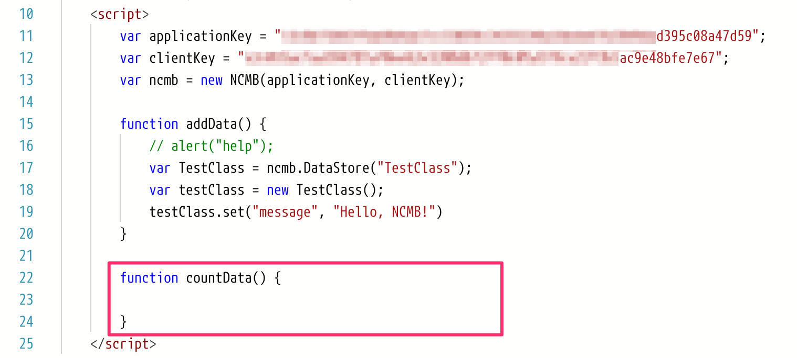
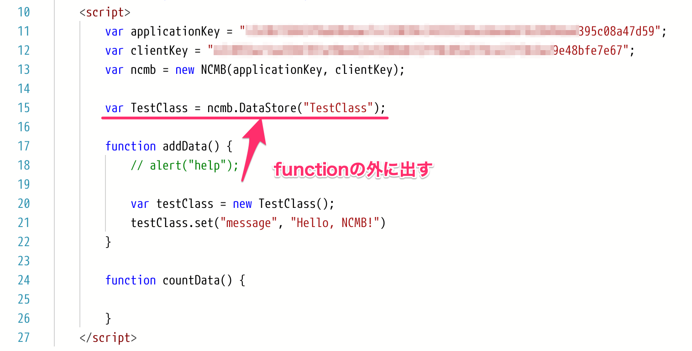

title: mobile backend を使ってみよう
class: animation-fade
layout: true

<!-- This slide will serve as the base layout for all your slides -->
.bottom-bar[
  {{title}}
]

---

class: impact

# {{title}}
## with Monaca

.right[]

.footnote[
.left[
.size_small_7[
Copyright 2020 FUJITSU CLOUD TECHNOLOGIES LIMITED<br>
Created by Natsumo Ikeda<br>
2020/02/04&nbsp;(2020/02/18update)
]
]
]


---
title: はじめに
layout: true
class: center, middle, animation-fade

---
# {{title}}

---
title: はじめに
layout: false

# 概要

とりあえず mobile backend を使ってみましょう。<br>そして、何ができるか実際に触って理解しましょう。

* 今日の演習だけでも mobile backend のデータベース機能「データストア」の基本はマスターできます👍

.bottom-bar[
{{title}}
]

---
title: はじめに

## アジェンダ

.size_small_7[
1. mobile backend って何？
1. mobile backend を今すぐ使うには
1. 実際に触ってみましょう①
  1. Monaca の準備
  1. Monaca の練習
  1. mobile backend の準備
  1. mobile backend と Monaca を連携する
  1. mobile backend にデータを保存する
1. 実際に触ってみましょう②
  1. mobile backend に保存したデータを取得する
1. （おまけ）おみくじアプリを作ってみましょう
1. おわりに
]
.bottom-bar[
{{title}}
]

---
title: 1.&nbsp;mobile backend って何？
layout: true
class: center, middle, animation-fade

---
# {{title}}

---
title: 1.&nbsp;mobile backend って何？
layout: false

## ニフクラ mobile backend とは何か？

.col-7[
.size_small_9[
一言で言うなれば<br>
「 **構築不要ですぐに使えるクラウドデータベース** 」<br>
アプリ開発に必要な機能は大体用意されているので、<br>
使い方さえマスターしてしまえばこっちのものです。<br>
<br>
これから学習することは、
* **何ができるか知る**
* **使い方を覚える**

の２点です。
]
]
.col-5[
.center[

]
]
.bottom-bar[
{{title}}
]

---
title: 2.&nbsp;mobile backend を今すぐ使うには
layout: true
class: center, middle, animation-fade

---
# {{title}}

---
title: 2.&nbsp;mobile backend を今すぐ使うには
layout: false

## mobile backend を今すぐ使うには

.size_small_9[
開発中のアプリがあればそれに組み込むのが一番良いですが、.size_small_7[（AndroidでもiOSでもUnityでも）]<br>
０からアプリを作る場合には .color_pink[**Monaca**] がオススメです👌
]
.col-7[
.size_small_9[
* mobile backend との連携が楽
* 環境構築不要：ブラウザで開発
* 使いやすい言語：JavaScript

などなど、親和性が高く使い勝手が良いです。

本講では .color_pink[**Monaca**] を使って mobile backend の使い方を習得していきましょう。
]
]
.col-5[
.center[

]
]

.bottom-bar[
{{title}}
]

---
title: 3.&nbsp;実際に触ってみましょう①
layout: true
class: center, middle, animation-fade

---
# {{title}}

---
title: 3.&nbsp;実際に触ってみましょう①
layout: false

## 実際に触ってみましょう①

1. Monaca の準備
1. Monaca の練習
1. mobile backend の準備
1. mobile backend と Monaca を連携する
1. mobile backend にデータを保存する

.bottom-bar[
{{title}}
]

---
title: 3.&nbsp;実際に触ってみましょう①

### 1. Monaca の準備

環境準備ができているか確認をしましょう。

* ブラウザ環境の準備
  * __<a href='https://www.google.com/chrome/' target='_blank'>Google Chrome&nbsp;↗️</a>__
* Monaca Education アカウントの取得
  * __<a href='https://monaca.education/ja/signup' target='_blank'>Monaca&nbsp;Education&nbsp;アカウント作成&nbsp;↗️</a>__

.bottom-bar[
{{title}}
]

.bottom-bar[
{{title}}
]

---
title: 3.&nbsp;実際に触ってみましょう①

### 1. Monaca の準備

.size_small_9[
Monaca にログインします。
]
.center[]

.size_small_7[
__<a href="https://edu.monaca.io/" target="_blank">Monaca Education トップページ ↗️</a>__<br>
`https://edu.monaca.io/`
]

.bottom-bar[
{{title}}
]

---
title: 3.&nbsp;実際に触ってみましょう①

### 1. Monaca の準備

.col-6[
.size_small_9[
プロジェクトを作ります。
]
.center[]
]
.col-6[
.size_small_9[
最小限のテンプレートを選択します。
]
.center[]
]
.bottom-bar[
{{title}}
]

---
title: 3.&nbsp;実際に触ってみましょう①

### 1. Monaca の準備

.size_small_9[
プロジェクト名はこのままでOKです。「作成」をクリックします。
]
.center[]

.bottom-bar[
{{title}}
]

---
title: 3.&nbsp;実際に触ってみましょう①

### 1. Monaca の準備

.size_small_9[
プロジェクトが作成されます。<br>
プロジェクトを選択して、「クラウドIDEで開く」をクリックします。

]
.center[]

.bottom-bar[
{{title}}
]

---
title: 3.&nbsp;実際に触ってみましょう①

### 1. Monaca の準備

.size_small_9[
プロジェクトが開かれます。
]
.center[]


.bottom-bar[
{{title}}
]

---
title: 3.&nbsp;実際に触ってみましょう①

### 2. Monaca の練習

.size_small_9[
アプリの画面を構成する、 `index.html` の `body` タグ内を少し編集してみましょう。
]
.center[]

.bottom-bar[
{{title}}
]

---
title: 3.&nbsp;実際に触ってみましょう①

### 2. Monaca の練習

.size_small_9[
一度消して、何か書いてみましょう。
]
.center[]

.bottom-bar[
{{title}}
]

---
title: 3.&nbsp;実際に触ってみましょう①

### 2. Monaca の練習
.col-9[
.size_small_9[
書けたら保存します。<br>
ツールバー左のボタンをクリックすると保存されます。
]
.center[]
]
.col-3[
.size_small_7[
✅コマンドでも保存できます
* Windows「Ctrl + s」
* Mac「command + s」
]
]
.bottom-bar[
{{title}}
]

---
title: 3.&nbsp;実際に触ってみましょう①

### 2. Monaca の練習

.size_small_9[
保存すると、右側プレビュー画面が更新され `body` タグ内に書いた文字が表示されます。
]
.center[]

.bottom-bar[
{{title}}
]

---
title: 3.&nbsp;実際に触ってみましょう①

### 2. Monaca の練習

.size_small_9[
それでは本題に入りましょう。<br>
**押すと mobile backend にデータが保存されるボタン** を作ってみましょう！<br>
さっき書き換えた文字の下に `button` タグを用意します。

.size_small_5[コーディングする内容：]
```html
<button>押してみて</button>
```

]
.size_small_5[完成イメージ：]<br>

.bottom-bar[
{{title}}
]

---
title: 3.&nbsp;実際に触ってみましょう①

### 2. Monaca の練習

.size_small_9[
書けたら保存をしてプレビュー画面で確認しましょう。
]
.center[]
.size_small_7[
✅ボタンが表示されますが、クリックしてもまだ何の反応もありません。
]
.bottom-bar[
{{title}}
]

---
title: 3.&nbsp;実際に触ってみましょう①

### 2. Monaca の練習

.size_small_9[
ボタンに **クリックイベント** （クリックしたときの動作）を追加しましょう。

.size_small_5[コーディングする内容：]<br>
```html
<button onclick="">押してみて</button>
```
]
.size_small_5[完成イメージ：]<br>


.bottom-bar[
{{title}}
]

---
title: 3.&nbsp;実際に触ってみましょう①

### 2. Monaca の練習


.size_small_9[
`""` の間に次のように書いてください。

.size_small_5[コーディングする内容：]<br>
```html
<button onclick="addData()">押してみて</button>
```
]
.size_small_5[完成イメージ：]<br>


.size_small_7[
`addData()` はこれから「 **mobile backend にデータを保存する処理** 」を書く **function** （関数）の名前です。
 ]
.bottom-bar[
{{title}}
]

---
title: 3.&nbsp;実際に触ってみましょう①

### 2. Monaca の練習
.size_small_9[
「 **mobile backend にデータを保存する処理** 」を書く function「 `addData()` 」を用意しましょう。
.size_small_7[
ここまでは html という言語で記述しましたが、
ここからは mobile backend を扱います。 JavaScript という言語を扱う場合は、`script` タグ内に記述します。
]
10行目の `script` タグの中に記述します。

.size_small_5[コーディングする内容：]<br>
```html
<script>
    function addData() {
      // ここに処理を書きます
    }
</script>
```
]

.bottom-bar[
{{title}}
]

---
title: 3.&nbsp;実際に触ってみましょう①

### 2. Monaca の練習

.size_small_5[完成イメージ：]<br>


.bottom-bar[
{{title}}
]

---
title: 3.&nbsp;実際に触ってみましょう①

### 2. Monaca の練習

.size_small_9[
ここで一旦、動作確認をしておきましょう。<br>
button と function が本当に連携しているのか？ を確認します。

button を押したとき **alert** を表示するように書いてみます。

.size_small_5[コーディングする内容：]<br>
```html
<script>
    function addData() {
      alert("ボタンが押されたよ");
    }
</script>
```
]

.bottom-bar[
{{title}}
]

---
title: 3.&nbsp;実際に触ってみましょう①

### 2. Monaca の練習

.size_small_5[完成イメージ：]<br>


.bottom-bar[
{{title}}
]

---
title: 3.&nbsp;実際に触ってみましょう①

### 2. Monaca の練習

.size_small_9[
保存してからプレビュー画面でボタンを押してみましょう。<br>
ブラウザの `alert` が表示されればOKです。
]
.center[]
.size_small_5[
✅次の作業のために alert のコードは先頭に `//` をつけて **コメント化** （実行されない状態）しておきましょう。
```js
// alert("ボタンが押されたよ");
```
]
.bottom-bar[
{{title}}
]

---
title: 3.&nbsp;実際に触ってみましょう①

### 3. mobile backend の準備

環境準備ができているか確認をしましょう。

* ニフクラ mobile backend アカウントの取得
  * __<a href='https://mbaas.nifcloud.com/signup.htm' target='_blank'>ニフクラ&nbsp;mobile&nbsp;backend&nbsp;アカウント作成&nbsp;↗️</a>__

.bottom-bar[
{{title}}
]

---
title: 3.&nbsp;実際に触ってみましょう①

### 3. mobile backend の準備

.size_small_9[
mobile backend にログインします。
]
.center[]

.size_small_7[
__<a href='https://mbaas.nifcloud.com/' target='_blank'>ニフクラ&nbsp;mobile&nbsp;backend&nbsp;トップページ&nbsp;↗️</a>__<br>
`https://mbaas.nifcloud.com/`
]
.bottom-bar[
{{title}}
]

---
title: 3.&nbsp;実際に触ってみましょう①

### 3. mobile backend の準備

.size_small_9[
ログインすると、「アプリの新規作成」画面が表示されます。`TestApp` と入力して、「新規作成」をクリックします。
]
.center[]
<br><br>
.size_small_7[
✅作成するスマートフォンアプリ毎に、mobile backend 上にも「 **アプリ** 」を作成します。
]
.bottom-bar[
{{title}}
]

---
title: 3.&nbsp;実際に触ってみましょう①

### 3. mobile backend の準備

アプリが作成されると、 **APIキー** が発行されます。後ほど使用します。一旦「OK」をクリックして画面を閉じます。

.col-6[
.center[]
]
.col-6[
.size_small_7[
✅ **APIキーは２種類**
* アプリケーションキー
  * アプリを特定するためのキー（住所のような物）
* クライアントキー
  * 認証キー
]
]
.bottom-bar[
{{title}}
]

---
title: 3.&nbsp;実際に触ってみましょう①

### 3. mobile backend の準備

.size_small_9[
管理画面のダッシュボードが表示されます。
]

.center[]

.bottom-bar[
{{title}}
]

---
title: 3.&nbsp;実際に触ってみましょう①

### 3. mobile backend の準備

.size_small_9[
これから保存するデータ（文字列）は「 **データストア** 」に保存されます。
]
.col-8[
.center[]
]
.col-4[
.size_small_7[
✅「データストア」が mobile backend 　　の「クラウドデータベース」です<br><br>
✅ デフォルトクラス：
* installation
  * プッシュ通知配信端末情報が格納されるクラス
* role
  * 会員管理で設定した会員グループが格納されるクラス
]
]

.bottom-bar[
{{title}}
]

---
title: 3.&nbsp;実際に触ってみましょう①

### 4. mobile backend と Monaca を連携する

**mobile backend にデータを保存する処理** を実装するために、mobile backend と Monaca を連携させるために必要な作業をします。

1. mobile backend の SDK を Monaca に導入する .size_small_5[（コンポーネントの追加）]
1. 導入した SDK を初期化（おまじない）して使える状態にする .size_small_5[（コーディング）]
1. 「Hello, NCMB!」と mobile backend に保存する処理を実装する .size_small_5[（コーディング）]
<br><br><br><br><br><br><br>

.size_small_7[
✅この２つは mobile backend を使用する場合に .color_pink[**必ず実施する内容**] です。覚えておきましょう！
]

.bottom-bar[
{{title}}
]

---
title: 3.&nbsp;実際に触ってみましょう①

### 4. mobile backend と Monaca を連携する
#### 1. mobile backend の SDK を Monaca に導入する .size_small_5[（コンポーネントの追加）]
.col-7[
.size_small_9[
Monaca の画面に戻ります。<br>
「設定」＞「JS/CSSコンポーネントの追加と削除」をクリックします。
]
]
.col-5[
.center[]
]
.bottom-bar[
{{title}}
]

---
title: 3.&nbsp;実際に触ってみましょう①

### 4. mobile backend と Monaca を連携する
#### 1. mobile backend の SDK を Monaca に導入する .size_small_5[（コンポーネントの追加）]

.size_small_9[
「コンポーネント名」に `ncmb` と入力して「検索する」をクリックします。
]
.center[]
.bottom-bar[
{{title}}
]

---
title: 3.&nbsp;実際に触ってみましょう①

### 4. mobile backend と Monaca を連携する
#### 1. mobile backend の SDK を Monaca に導入する .size_small_5[（コンポーネントの追加）]

.size_small_9[
mobile backend のSDK「ncmb」が表示されるので「追加」をクリックします。
]
.center[]

<br><br><br><br><br><br>

.size_small_7[
✅「ncmb」は 「**N** IF **C** LOUD **m** obile **b** ackend」の頭文字です。
]

.bottom-bar[
{{title}}
]

---
title: 3.&nbsp;実際に触ってみましょう①

### 4. mobile backend と Monaca を連携する
#### 1. mobile backend の SDK を Monaca に導入する .size_small_5[（コンポーネントの追加）]

.size_small_9[
バージョンはそのまま（最新版）で、「インストール」をクリックします。
]
.center[]

.bottom-bar[
{{title}}
]

---
title: 3.&nbsp;実際に触ってみましょう①

### 4. mobile backend と Monaca を連携する
#### 1. mobile backend の SDK を Monaca に導入する .size_small_5[（コンポーネントの追加）]
.col-6[
.size_small_9[
必ずチェックボックスにチェックを入れて、「保存」をクリックします。
]
.size_small_7[
✅チェックをしないと SDK の実態が導入されません。
]

]
.col-6[
.center[]
]
.bottom-bar[
{{title}}
]

---
title: 3.&nbsp;実際に触ってみましょう①

### 4. mobile backend と Monaca を連携する
#### 1. mobile backend の SDK を Monaca に導入する .size_small_5[（コンポーネントの追加）]

.col-5[
.size_small_9[
一覧に「ncmb」が表示されればSDK導入完了です。

.size_small_7[
✅「JS/CSSコンポーネントの追加と削除」タブは閉じておきましょう。
]

]
]
.col-7[
.center[]
]
.bottom-bar[
{{title}}
]

---
title: 3.&nbsp;実際に触ってみましょう①

### 4. mobile backend と Monaca を連携する
#### 2. 導入した SDK を初期化（おまじない）して使える状態にする .size_small_5[（コーディング）]

.size_small_9[
SDKは使う前に必ず初期化（おまじない）をする必要があります。初期化には mobile backend でアプリ作成時に発行された  **APIキー** を使います。<br>
Monaca （index.html）を開き、APIキーの置き場を用意します。
]

.col-6[
.size_small_5[
コーディングする内容：<br>
]
.size_small_7[
```js
var applicationKey = "";
var clientKey = "";
```
]
.size_small_5[
（参考）scriptタグ内の現状：<br>

]
]
.col-6[
.size_small_5[
完成イメージ：<br>

]
]

.bottom-bar[
{{title}}
]

---
title: 3.&nbsp;実際に触ってみましょう①

### 4. mobile backend と Monaca を連携する
#### 2. 導入した SDK を初期化（おまじない）して使える状態にする .size_small_5[（コーディング）]

.col-5[
.size_small_9[
mobile backend の管理画面を開いて、APIキーを確認します。<br>
APIキーは「アプリ設定」にあります。
]
]
.col-7[
.center[]
]
.bottom-bar[
{{title}}
]

---
title: 3.&nbsp;実際に触ってみましょう①

### 4. mobile backend と Monaca を連携する
#### 2. 導入した SDK を初期化（おまじない）して使える状態にする .size_small_5[（コーディング）]

.size_small_9[
それぞれ「コピーボタン」を使ってコピーを取り先ほど用意した `""` の間に貼り付けます。
]

.col-5[
.size_small_5[
APIキーをコピーする：
]


]
.col-7[
.size_small_5[
完成イメージ：
]

]
.bottom-bar[
{{title}}
]

---
title: 3.&nbsp;実際に触ってみましょう①

### 4. mobile backend と Monaca を連携する
#### 2. 導入した SDK を初期化（おまじない）して使える状態にする .size_small_5[（コーディング）]

.size_small_9[
APIキーを **引数** に設定して以下のように書くとSDKが初期化されます。<br>
]
.size_small_5[
コーディングする内容：
]
.size_small_7[
```js
var ncmb = new NCMB(applicationKey, clientKey);
```
]
.size_small_5[
完成イメージ：
]


.size_small_5[
✅初期化作業はおまじないのようなものです。毎回必ず実施する作業として覚えておきましょう。<br>
✅引数とは、プログラムや関数に渡される値のことです。ここではSDKの初期化にAPIキーを使うため引数として値を渡しています。
]

.bottom-bar[
{{title}}
]

---
title: 3.&nbsp;実際に触ってみましょう①

### 5. mobile backend にデータを保存する

.size_small_9[
連携ができたので、あとは保存処理のコードを `addData()` メソッド内に記述すれば完成です。<br>
最初に保存先クラスを作ります。クラス名は `TestClass` としておきましょう。
]
.col-6[
.size_small_5[
コーディングする内容：
]
.size_small_7[
```js
var TestClass = ncmb.DataStore("TestClass");
```
]
.size_small_5[
（参考） `addData()` メソッド：
]

]
.col-6[
.size_small_5[
完成イメージ：
]

]
.bottom-bar[
{{title}}
]

---
title: 3.&nbsp;実際に触ってみましょう①

### 5. mobile backend にデータを保存する

.size_small_9[
次にクラス `TestClass` のインスタンスを生成します。
]
.size_small_5[
コーディングする内容：
]
.size_small_7[
```js
var testClass = new TestClass();
```
]
.size_small_5[
完成イメージ：
]


.size_small_5[
✅インスタンスとは、「実体」を表します。ここではデータを保存するためクラスの実体としてのインスタンスに値を格納します。
]

.bottom-bar[
{{title}}
]

---
title: 3.&nbsp;実際に触ってみましょう①

### 5. mobile backend にデータを保存する

.size_small_9[
インスタンスに保存する値をセットします。フィールド名を `message` 、値を `Hello, NCMB!` とします。
]
.col-5[
.size_small_5[
コーディングする内容：
]
.size_small_7[
```js
testClass.set("message", "Hello, NCMB!")
```
]
]
.col-7[
.size_small_5[
完成イメージ：
]
.center[]
]
<br><br><br><br><br><br>
.size_small_5[
* `.set("key", "value")` ：値の設定
  * key: フィールド名
  * value: 値
]
.size_small_5[
✅クラス名やフィールド名<br>
クラス名／フィールド名は無ければ新規作成してくれるし、既に存在しているならば既存のクラス／フィールドを指定してくれます。<br>
存在有無を気にする必要がないので楽ですね👏
]

.bottom-bar[
{{title}}
]

---
title: 3.&nbsp;実際に触ってみましょう①

### 5. mobile backend にデータを保存する

.size_small_9[
値を設定したら保存します。JavaScriptなので、メソッドチェーンで書けます。
]
.col-5[
.size_small_5[
コーディングする内（２行目）：
]
.size_small_7[
```js
testClass.set("message", "Hello, NCMB!")
         .save();
```
]
]
.col-7[
.size_small_5[
完成イメージ：
]
.center[]
]
<br><br><br><br><br><br>
.size_small_5[
* `.save()` ：保存
]
.size_small_5[
✅メソッドチェーンとは、`.` で続けて処理メソッドを記述するJavaScriptの作法です。 `set` と `save` を繋げて１文で記述できます。<br>
　　（文末に記述する `;` は最後に１つだけ。 `set` の後ろにはない。）
]

.bottom-bar[
{{title}}
]

---
title: 3.&nbsp;実際に触ってみましょう①

### 5. mobile backend にデータを保存する

.size_small_9[
動作確認をしてみましょう。プロジェクトを保存して、プレビュー画面からボタンを押します。
]
.center[]

.bottom-bar[
{{title}}
]

---
title: 3.&nbsp;実際に触ってみましょう①

### 5. mobile backend にデータを保存する

.size_small_9[
mobile backend 上に正しくデータが保存されたか確認してみましょう。「データストア」を開くと、新しく「TestClass」ができています。クリックすると保存されたデータが確認できます。
]
.col-8[
.center[]
]
.col-4[
.size_small_5[
✅ **TRY** <br>Monacaのプレビュー画面に戻ってボタンを何度か押してから改めて TestClass を確認してみましょう😘
]
]
.bottom-bar[
{{title}}
]


---
title: 4.&nbsp;実際に触ってみましょう②
layout: true
class: center, middle, animation-fade

---
# {{title}}

---
title: 4.&nbsp;実際に触ってみましょう②
layout: false

## 4.&nbsp;実際に触ってみましょう②

1. mobile backend に保存したデータを取得する

.bottom-bar[
{{title}}
]

---
title: 4.&nbsp;実際に触ってみましょう②

### 1. mobile backend に保存したデータを取得する

.size_small_9[
新しいボタン「押してみて2」を押すと **mobile backend 上にデータが何件保存されているか** を取得して画面に表示するようにしてみましょう👀
]
.size_small_5[
完成イメージ：
]


.bottom-bar[
{{title}}
]

---
title: 4.&nbsp;実際に触ってみましょう②

### 1. mobile backend に保存したデータを取得する

.size_small_9[
Monaca（index.html）を開きます。<br>
`body` タグ内に **新しいボタン** と取得した件数を表示するための `div` タグを用意します。
]
.size_small_7[
ボタンが押されたら呼び出される function は「 `countData()` 」としましょう。<br>
また、 `div` タグには `id` を付けておきましょう。「 `counter` 」としましょう。
]
.size_small_5[
コーディングする内容：
]
.size_small_7[
```html
<button onclick="countData()">押してみて2</button>
<div id="counter"></div>
```
]
.size_small_5[
完成イメージ：
]


.bottom-bar[
{{title}}
]

---
title: 4.&nbsp;実際に触ってみましょう②

### 1. mobile backend に保存したデータを取得する

.size_small_9[
**mobile backend に保存したデータの件数を取得する処理** を書くfunction「 `countData()` 」を用意しましょう。
]
.col-5[
.size_small_5[
コーディングする内容：
]
.size_small_7[
```js
function countData() {

}
```
]
]
.col-7[
.size_small_5[
完成イメージ：
]
.center[]
]
.bottom-bar[
{{title}}
]

---
title: 4.&nbsp;実際に触ってみましょう②

### 1. mobile backend に保存したデータを取得する
.size_small_9[
**mobile backend に保存したデータの件数を取得する処理** を実装していきます。<br>
保存先クラスは、先ほどと同じクラスを使うのでコードを共有します。保存先クラスの生成コードをfunctionの外に出して **フィールド変数** にします。
]
.col-7[
.size_small_5[
完成イメージ：
]
.center[]
]
.col-5[
.size_small_5[
```js
var TestClass = ncmb.DataStore("TestClass");
```
を選択して「切り取り」、function の外で「貼り付け」します。
<br><br><br><br><br><br><br><br><br><br><br><br>
✅functionの中の変数は同じfunctionの中からのみ利用可能です。<br>フィールドの変数にする事で他のfunctionからも利用できるすることができます。

]
]

.bottom-bar[
{{title}}
]

---
title: 4.&nbsp;実際に触ってみましょう②

### 1. mobile backend に保存したデータを取得する

.size_small_9[
データを取得するにはクラスに対して検索処理を行います。<br>
保存件数を取得するには `count()` オプションを使います。
]
.col-5[
.size_small_5[
コーディングする内容：
]
.size_small_7[
```js
TestClass.count()
```
* `.count()`：件数を指定
]
]
.col-7[
.size_small_5[
完成イメージ：
]
.center[]
]


.bottom-bar[
{{title}}
]

---
title: 4.&nbsp;実際に触ってみましょう②

### 1. mobile backend に保存したデータを取得する

.size_small_9[
全件数を取得したいので、全件検索処理 `fetchAll()` を実行します。
]
.col-5[
.size_small_5[
コーディングする内容（２行目）：
]
.size_small_7[
```js
TestClass.count()
         .fetchAll()
```
* `.fetchAll()`：全件検索処理
]
]
.col-7[
.size_small_5[
完成イメージ：
]
.center[]
]
.bottom-bar[
{{title}}
]

---
title: 4.&nbsp;実際に触ってみましょう②

### 1. mobile backend に保存したデータを取得する

.size_small_9[
コールバック関数を設定します。<br>
返却値をそれぞれ、成功時： `results` 、失敗時： `error` とします。
]
.col-5[
.size_small_5[
コーディングする内容（３行目以降）：
]
.size_small_7[
```js
TestClass.count()
         .fetchAll()
         .then(function(results){

         })
         .catch(function(error){

         });
```
* `.then()`：検索成功時の処理
* `.catch()`：検索失敗時の処理
]
]
.col-7[
.size_small_5[
完成イメージ：
]
.center[]
]
.size_small_5[
✅ コールバック関数とは、mobile backend に対して処理を実行した際呼ばれる関数で、成功・失それぞれ違う関数が呼ばれます。
]

.bottom-bar[
{{title}}
]

---
title: 4.&nbsp;実際に触ってみましょう②

### 1. mobile backend に保存したデータを取得する

.size_small_9[
検索取得に成功すると、返却値から件数の情報を取得できます。ここでは `results.count` で取得できます。
]
.col-5[
.size_small_5[
コーディングする内容：
]
.size_small_7[
```js
var num = results.count;
```
*  `[返却値].count` ：件数の取得
]
]
.col-7[
.size_small_5[
完成イメージ：
]
.center[]
]

.bottom-bar[
{{title}}
]

---
title: 4.&nbsp;実際に触ってみましょう②

### 1. mobile backend に保存したデータを取得する
.size_small_9[
先ほど作った `div` タグに件数を表示しましょう。
]
.size_small_5[
コーディングする内容：
]
.size_small_7[
```js
document.getElementById("counter").innerHTML = num;
```
]
.size_small_5[
完成イメージ：
]


.bottom-bar[
{{title}}
]

---
title: 4.&nbsp;実際に触ってみましょう②

### 1. mobile backend に保存したデータを取得する
.size_small_9[  
検索取得に失敗した場合は `alert` でエラーを表示するようにしておきましょう☝️
]
.size_small_5[
コーディングする内容：
]
.size_small_7[
```js
alert("Error: " + error);
```
]
.size_small_5[
完成イメージ：
]


.bottom-bar[
{{title}}
]

---
title: 4.&nbsp;実際に触ってみましょう②

### 1. mobile backend に保存したデータを取得する

.size_small_9[
動作確認をしてみましょう。<br>
プロジェクトを保存して、プレビュー画面からボタンを押してみましょう。
]
.center[]


.bottom-bar[
{{title}}
]

---
title: 4.&nbsp;実際に触ってみましょう②

### 1. mobile backend に保存したデータを取得する

.size_small_9[
件数が表示されれば取得成功です！<br>
mobile backend の管理画面を確認して、実際の件数と一致しているか確認してみましょう😄
]
.center[]
<br><br><br><br>
.size_small_5[
✅ **TRY** <br>
最初に作った「押してみて」ボタンを何回か押してから、「押してみて2」ボタンを押してみましょう。件数の変化がわかります😉
]
.bottom-bar[
{{title}}
]

---
title: （おまけ）<br>おみくじアプリを作ってみましょう
layout: true
class: center, middle, animation-fade

---
# {{title}}

---
title: （おまけ）おみくじアプリを作ってみましょう
layout: false

## おみくじアプリ

.size_small_9[
おみくじアプリを作ってみましょう。手順は以下です。

1. おみくじデータを mobile backend に作成する（管理画面から保存）
2. ボタンを押すとおみくじの結果が表示される
]
.center[]

<br><br><br><br>
.size_small_5[
✅2.はここまで学習した内容の復習です！頑張って完成させてみましょう！
]

.bottom-bar[
{{title}}
]

---
title: （おまけ）おみくじアプリを作ってみましょう

### おみくじデータを mobile backend に作成する（管理画面から保存）

.size_small_9[
mobile backend に新しいアプリ「 **Omikuji** 」を作成し、データストアを開きます。<br>
「＋作成▼」＞「新規作成」をクリックします。
]
.center[]

.bottom-bar[
{{title}}
]

---
title: （おまけ）おみくじアプリを作ってみましょう

### おみくじデータを mobile backend に作成する（管理画面から保存）

.size_small_9[
クラス名も「 **Omikuji** 」にしましょう。入力したら「作成する」をクリックします。
]
.center[]

<br><br><br><br>
.size_small_5[
✅クラス名を間違えると正しくおみくじが動かないので注意！
]

.bottom-bar[
{{title}}
]

---
title: （おまけ）おみくじアプリを作ってみましょう

### おみくじデータを mobile backend に作成する（管理画面から保存）

.size_small_9[
クラスが作成されたらデータを作っていきます。<br>
上部にある「＋新しいフィールド」をクリックします。フィールド名を「`result`」（おみくじを引いたときの”結果”の意味）にしましょう。<br>
フィールドができたらデータを入れるレコードを作ります。「＋新しいレコード」をクリックすると次のようになります。
]
.center[]

.bottom-bar[
{{title}}
]

---
title: （おまけ）おみくじアプリを作ってみましょう

### おみくじデータを mobile backend に作成する（管理画面から保存）

.size_small_9[
`result`に値を入れてみます。「大吉」を入れましょう。ダブルクリックすると入力できるようになります。
]
.center[]

.size_small_9[
「大吉」と書いて「Enter」キーを押すとデータが作成されます。
]
.center[]

.bottom-bar[
{{title}}
]

---
title: （おまけ）おみくじアプリを作ってみましょう

### おみくじデータを mobile backend に作成する（管理画面から保存）

.size_small_9[
同様にしてフィールドを追加し、「中吉」「小吉」「吉」「凶」「大凶」などなど入れてみましょう。いくつでも、何を書いてもOKです！
]
.center[]


.bottom-bar[
{{title}}
]

---
title: （おまけ）おみくじアプリを作ってみましょう

### ボタンを押すとおみくじの結果が表示される

.size_small_9[
次の手順で実装していきましょう。
]
.col-7[
.size_small_7[
1. Monaca に新しくアプリ（最小限のテンプレート）を作る
1. Monaca に mobile backend の SDK を導入する
1. 導入したSDKを初期化する（おまじない）
1. 次のコードを index.htmlに記述
]
]
.col-5[
.size_small_4[
`body` タグ内に記述：
```html
<button onclick="omikuji();">おみくじを引く</button>
結果：<span id="result"></span>
```
]
.size_small_4[
`script` タグ内に記述：
```js
  function omikuji() {
    var Omikuji = ncmb.DataStore("Omikuji");
    Omikuji.fetchAll()
           .then(function(objects){
             // データ数内で乱数を作成
             var random = Math.floor(Math.random()*objects.length);
             // 乱数番目のデータ
             var object = objects[random];
             // 「result」フィールドの値を取得
             var result= object.get("result");
             // 画面に結果を表示
             document.getElementById("result").innerText = result;
          })
          .catch(function(error){
             alert("Error: " + error.code);
          });
  }
```
]
]
<br><br><br><br><br><br><br><br><br><br><br><br>
.size_small_5[
✅乱数を発生させておみくじの当たりを決めています。取得した値の処理は少し難しいので詳しくは参考書で学習しましょう。
]

.bottom-bar[
{{title}}
]

---
title: おわりに
layout: true
class: center, middle, animation-fade

---
# {{title}}

---
title: おわりに
layout: false

## まとめ

.size_small_9[
* クラウドデータベースを活用するとできること
* クラウドデータベースの基本の使い方
]

.bottom-bar[
{{title}}
]

---
title: おわりに

## 学習した内容の確認

.size_small_9[
* 本講座の内容は、参考書 第２章、第３章、第４章の内容の抜粋です
* 本講座はクラウドデータベースの基礎知識の習得ができるよう構成されています
* 専門用語や検索取得時のオプション（クエリなど）等については細かく触れていませんので、参考書で追加学習が必要です
* 参考書で学習を進める際は、第４章までの内容を復習後、第５章より学習を進めていく事をお薦めします
]

.bottom-bar[
{{title}}
]
